# Farman Printing Press — System Architecture

## 0. Build status

Every file in the tree below now exists and the project typechecks,
lints, and `next build`s cleanly (verified against a dummy `DATABASE_URL`
— no live Postgres is provisioned yet, so nothing has actually round-
tripped through a real database). A few files exist beyond what's listed
below because the pieces they support turned out to need them:
`server/actions/client-actions.ts`, `challan-actions.ts`,
`network-actions.ts`, `catalog-actions.ts`, `inquiry-actions.ts`,
`portal-actions.ts`, and `server/auth-options.ts` + `types/next-auth.d.ts`
(the actual NextAuth wiring the auth.ts skeleton pointed at).

**Still open, deliberately:**
- No Postgres has been provisioned — `.env` needs a real `DATABASE_URL`/
  `DIRECT_URL`, then `npm run db:migrate` and `npm run db:seed`.
- The client portal is read-only-scaffolded but has no working sign-in:
  `auth-options.ts` only wires a staff Credentials provider (User has a
  passwordHash to check against). Client has no password/token field, so
  portal auth needs a real magic-link flow — that needs a NextAuth Prisma
  Adapter plus the Account/Session/VerificationToken tables schema.prisma
  doesn't have yet, which is a schema decision, not just wiring.
- `components/ui/*` are dependency-free stand-ins (documented inline)
  for the real shadcn CLI output — fine for now, swap in
  `npx shadcn-ui@latest add ...` when Radix-based focus-trapping/animation
  actually matters.
- Nothing has been visually reviewed in a browser yet.

## 1. Route groups map straight to the three audiences

```
src/app/
├── (public)/                    # No auth. SEO'd, fast, cacheable.
│   ├── layout.tsx                #   Marketing header/footer
│   ├── page.tsx                  #   Home / hero
│   ├── catalog/
│   │   ├── page.tsx               #   ID Cards, Stamps, Shields, Panaflex, Mugs, Envelopes…
│   │   └── [categorySlug]/page.tsx
│   └── inquiry/
│       └── page.tsx               #   "Request a Quote" form -> creates Inquiry + Assets
│
├── (portal)/                    # Auth required, role = CLIENT (external)
│   ├── layout.tsx                 #   Client-scoped nav: only their own orders/ledger
│   └── client/
│       ├── orders/page.tsx        #   Their jobs + status (read-only pipeline view)
│       ├── orders/[orderId]/page.tsx
│       └── ledger/page.tsx        #   Their own invoices/payments/balance
│
├── (dashboard)/                 # Auth required, role = staff (RBAC via middleware.ts)
│   ├── layout.tsx                 #   Sidebar: Orders, Quotations, Invoices, Challans,
│   │                               #   Clients, Vendors, Assets, Network, Settings
│   ├── orders/
│   │   ├── page.tsx               #   ⭐ Kanban/table pipeline (this is deliverable #3)
│   │   └── [orderId]/page.tsx     #   Order detail: line items, assets, docs, timeline
│   ├── clients/
│   │   └── [clientId]/ledger/page.tsx   #   ⭐ Client ledger (deliverable #3)
│   ├── quotations/page.tsx + [id]/page.tsx
│   ├── invoices/page.tsx + [id]/page.tsx
│   ├── challans/page.tsx + [id]/page.tsx
│   └── network/page.tsx           #   Partner presses + shared assets (multi-tenant sharing)
│
└── api/                          # REST endpoints for mobile/webhooks/PDF fetches;
    ├── orders/route.ts            #   the dashboard itself prefers Server Actions
    ├── orders/[orderId]/route.ts    (src/server/actions/*) for mutations — the API
    ├── invoices/route.ts            layer exists for anything outside the Next.js
    ├── ledger/[clientId]/route.ts   request/response cycle.
    └── documents/[type]/[id]/pdf/route.ts   # streams the printable PDF
```

**Why three route groups instead of one app with permission checks sprinkled
everywhere:** each group gets its own `layout.tsx`, so the public catalog
ships zero auth/session JS, the client portal never accidentally renders a
staff-only nav item, and the dashboard's RBAC gate lives in exactly one
`middleware.ts` matcher instead of being re-checked per page.

## 2. Directory structure (full)

```
fpp-erp/
├── prisma/
│   ├── schema.prisma
│   ├── seed.ts                          # demo press + sample orders/invoices
│   └── migrations/0001_init/migration.sql
├── src/
│   ├── app/                             # see route map above
│   ├── components/
│   │   ├── ui/                          # shadcn primitives (button, dialog, table, badge…)
│   │   ├── orders/
│   │   │   ├── OrderKanbanBoard.tsx     # drag-and-drop pipeline (@dnd-kit)
│   │   │   ├── OrderTable.tsx           # dense tabular fallback / search view
│   │   │   ├── OrderStatusBadge.tsx
│   │   │   ├── LineItemsEditor.tsx      # shared by Order/Quotation/Invoice forms
│   │   │   └── OrderDetailPanel.tsx
│   │   ├── ledger/
│   │   │   ├── LedgerTable.tsx
│   │   │   ├── LedgerSummaryCards.tsx
│   │   │   └── RecordPaymentDialog.tsx
│   │   ├── documents/                   # @react-pdf/renderer templates matching
│   │   │   ├── BillPdf.tsx              #   the physical bill/quotation/challan pads
│   │   │   ├── QuotationPdf.tsx
│   │   │   └── ChallanPdf.tsx
│   │   └── catalog/
│   │       ├── ServiceCard.tsx
│   │       └── InquiryForm.tsx
│   ├── server/
│   │   ├── db.ts                        # Prisma client singleton
│   │   ├── auth.ts                      # NextAuth config + getSession/requireRole helpers
│   │   ├── actions/                     # 'use server' mutations, called directly from
│   │   │   ├── order-actions.ts         #   client components — no hand-rolled fetch()
│   │   │   ├── ledger-actions.ts
│   │   │   ├── invoice-actions.ts
│   │   │   ├── quotation-actions.ts
│   │   │   └── asset-actions.ts
│   │   └── services/
│   │       ├── numbering.ts             # transactional per-press document numbers
│   │       ├── storage.ts               # Supabase Storage / S3 signed URL helper
│   │       └── pdf/render.ts            # @react-pdf/renderer -> Buffer for api routes
│   ├── lib/
│   │   ├── currency.ts                  # PKR formatting, paisa<->rupee helpers
│   │   ├── order-status.ts              # pipeline stage config (labels, order, colors)
│   │   ├── validation.ts                # zod schemas shared by actions + forms
│   │   └── utils.ts                     # cn() etc.
│   ├── hooks/
│   │   ├── use-orders.ts                # React Query wrapping the server actions
│   │   └── use-ledger.ts
│   ├── types/
│   │   └── index.ts                     # DTOs shared between server + client components
│   └── middleware.ts                    # session check + role gate per route group
├── package.json
├── tailwind.config.ts
└── .env.example
```

## 3. Data flow for the core pipeline

```mermaid
flowchart LR
  A[Public Inquiry Form] -->|creates| B(Inquiry)
  B -->|staff converts| C(Order: INQUIRY)
  C --> D(Order: QUOTATION)
  D -->|Quotation PDF sent| E(Order: DESIGN_APPROVAL)
  E -->|client approves artwork| F(Order: IN_PRODUCTION)
  F --> G(Order: READY_FOR_DELIVERY)
  G -->|Delivery Challan printed| H(Order: INVOICED)
  H -->|Invoice + Payment recorded| I(Order: COMPLETED)
  H -->|posts debit| J[(ClientLedgerEntry)]
  I -->|payment posts credit| J
```



Every status transition writes an `OrderStatusEvent` row (for pipeline
analytics) and every `Invoice`/`Payment` writes a `ClientLedgerEntry` inside
the same DB transaction (`src/server/actions/ledger-actions.ts`), so the
ledger balance is never derived by summing invoices minus payments on the
fly — it's authoritative and append-only, like the paper ledger it replaces.

## 4. Multi-tenancy & inter-press sharing

- Every business table carries `pressId`. Row-level scoping happens in one
  place: `src/server/db.ts` exposes a `scopedDb(pressId)` helper that Prisma
  middleware uses to inject a `where: { pressId }` filter automatically, so
  a forgotten `.findMany()` filter can't leak another press's data.
- Two presses become collaborators via `PressPartnership` (status
  `PENDING → ACTIVE`), not by sharing logins. Once `ACTIVE`, either side can
  create a `SharedAsset` scoped to one `Asset` + optionally one `Order`,
  with `VIEW` or `DOWNLOAD` permission and an optional expiry — this is how
  outsourced jobs hand off a CDR/PDF without giving the partner press access
  to the rest of the tenant's clients or ledger.

## 5. Auth & RBAC

- NextAuth (credentials or magic-link) issues a session carrying
  `{ userId, pressId, role }` for staff, or `{ clientId, pressId }` for
  portal users.
- `middleware.ts` matches `/dashboard/:path*` and `/client/:path*`, denies
  unauthenticated requests, and coarse-gates by role (e.g. only
  `OWNER_ADMIN`/`ACCOUNTANT` may hit `/dashboard/clients/*/ledger`).
- Fine-grained checks (e.g. a `GRAPHIC_DESIGNER` can update `designerId`'s
  own orders but not void an invoice) live next to the mutation in
  `src/server/actions/*`, via a `requireRole()` guard — see
  `order-actions.ts` below.

## 6. PDF generation matches the physical pads exactly

`components/documents/{BillPdf,QuotationPdf,ChallanPdf}.tsx` use
`@react-pdf/renderer` and reproduce the layout of the scanned bill books:
letterhead (name, NTN, head/branch office, phone/email/website), a boxed
`S.No | Particulars | Qty | Rate | Amount` table with a `Total` row and a
`Signature` line for Bills/Quotations, and `S.No | Particulars | Quantity`
with `Delivered by` / `Received by` lines (no pricing columns) for the
Delivery Challan. `src/server/services/pdf/render.ts` renders these to a
buffer that `api/documents/[type]/[id]/pdf/route.ts` streams back as
`application/pdf`.
